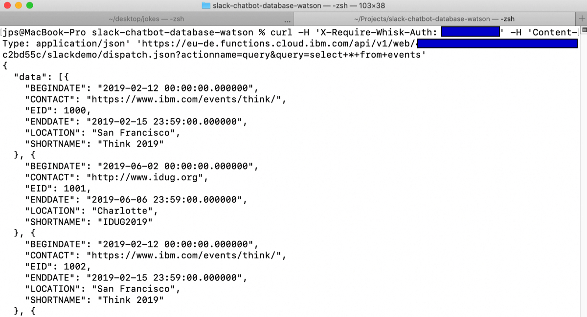

# Foreword related to this fork
- This is a fork of a Db2 backed chatbot that now can also be used as a CRUD backend leveraging Db2 on IBM Cloud.
- If you only need a Db2 backend follow the tutorial below and leave out the Slack and Watson Assistant parts.

## Changes to the original repo
- [dispatch.js](dispatch.js) now contains a dbQuery function that can be used to perform queries against the database
- [Slack Db2 Chatbot & CRUD backend.postman_collection.json](Slack%20Db2%20Chatbot%20&%20CRUD%20backend.postman_collection.json) contains the Postman collection

## SQL Queries
Db2 supports SQL and a query like **SELECT * FROM EVENTS** can be performed by using Postman or curl (use YOURSECRET as password).

# Original Tutorial

**Note:**   
Code relating to a previous version of the tutorial that utilized the now deprecated `web_action` to call Cloud Function actions is  available in the branch [20191211_web_action](https://github.com/IBM-Cloud/slack-chatbot-database-watson/tree/20191211_web_action). The current version is using a webhook in IBM Watson Assistant to invoke the serverless functionality.

Code relating to a previous version of the tutorial that utilized Cloud Foundry organization and spaces for IBM Cloud Functions is available in the branch [CloudFoundry-based-20191114](https://github.com/IBM-Cloud/slack-chatbot-database-watson/tree/CloudFoundry-based-20191114). The current version is based on using IAM namespaces for Cloud Functions packages and actions.

An even older code version along with the related instructions is kept in the [branch v1_upto_2019_04](https://github.com/IBM-Cloud/slack-chatbot-database-watson/tree/v1_upto_2019_04).

# Build a database-driven Slackbot with IBM Watson™ Assistant

Code to build a Slackbot to create and search Db2 database entries for events and conferences. The Slackbot is backed by the IBM Watson Assistant service. In older versions of this tutorial, an IBM Cloud Databases for PostgreSQL database could be used instead of Db2. The related files have an additional `.pg.` in their name and code can be found in the historic branches. 

The tutorial with detailed step-by-step instructions is available at https://cloud.ibm.com/docs/tutorials?topic=solution-tutorials-slack-chatbot-database-watson#slack-chatbot-database-watson. The tutorial is part of the [IBM Cloud tutorials](https://cloud.ibm.com/docs/tutorials?topic=solution-tutorials-tutorials#tutorials) 

# Files in this repository
The files in this repository have the following purpose:
* [changeActionSecret.sh](changeActionSecret.sh): shell script to update (change) the secret for invoking the web actions used by the chatbot. You still need to manually update the related dialog node.
* [cleanup.sh](cleanup.sh): shell script to drop Db2 table and delete Db2-related Cloud Functions actions
* [skill-TutorialSlackbot.json](skill-TutorialSlackbot.json): Skill / Workspace file used with IBM Watson Assistant service
* [db2-setup.js](db2-setup.js): code for Cloud Functions action which creates a Db2 table, fills it with sample data or cleans it up
* [dispatch.js](dispatch.js): code for Cloud Functions action which dispatches the incoming webhook request to the individual subfunctions to search records or insert new data
* [setup.sh](setup.sh): shell script to set up Cloud Functions actions, bind credentials, create a Db2 table and fill sample data
* [tables.sql](tables.sql): table schema

# Related Content
Chatbot-related blog posts:
* [Database-driven Slack chatbot with Conversation service](https://www.ibm.com/blogs/bluemix/2018/02/database-slack-chatbot-conversation/)
* [Slack Chatbot with PostgreSQL Backend](https://www.ibm.com/blogs/bluemix/2018/12/slack-chatbot-with-postgresql-backend/)
* [Chatbots: Some tricks with slots in IBM Watson Conversation](https://www.ibm.com/blogs/bluemix/2018/02/chatbots-some-tricks-with-slots-in-ibm-watson-conversation/)
* [Lively chatbots: Best Practices](https://www.ibm.com/blogs/bluemix/2017/07/lively-chatbots-best-practices/)
* [Building chatbots: more tips and tricks](https://www.ibm.com/blogs/bluemix/2017/06/building-chatbots-tips-tricks/)

